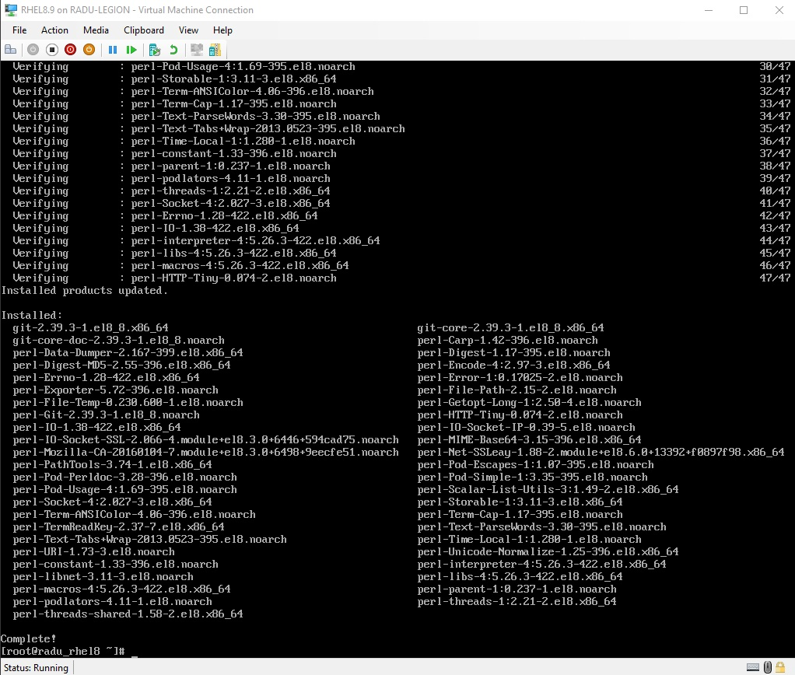
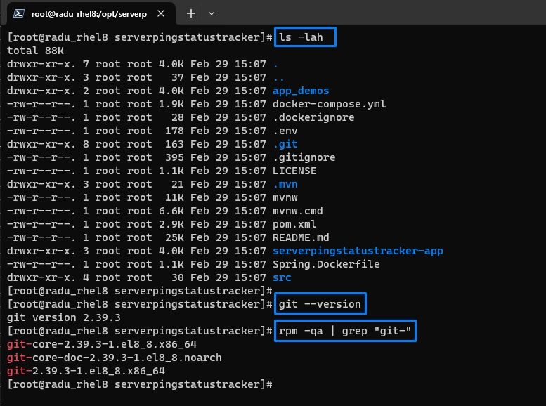
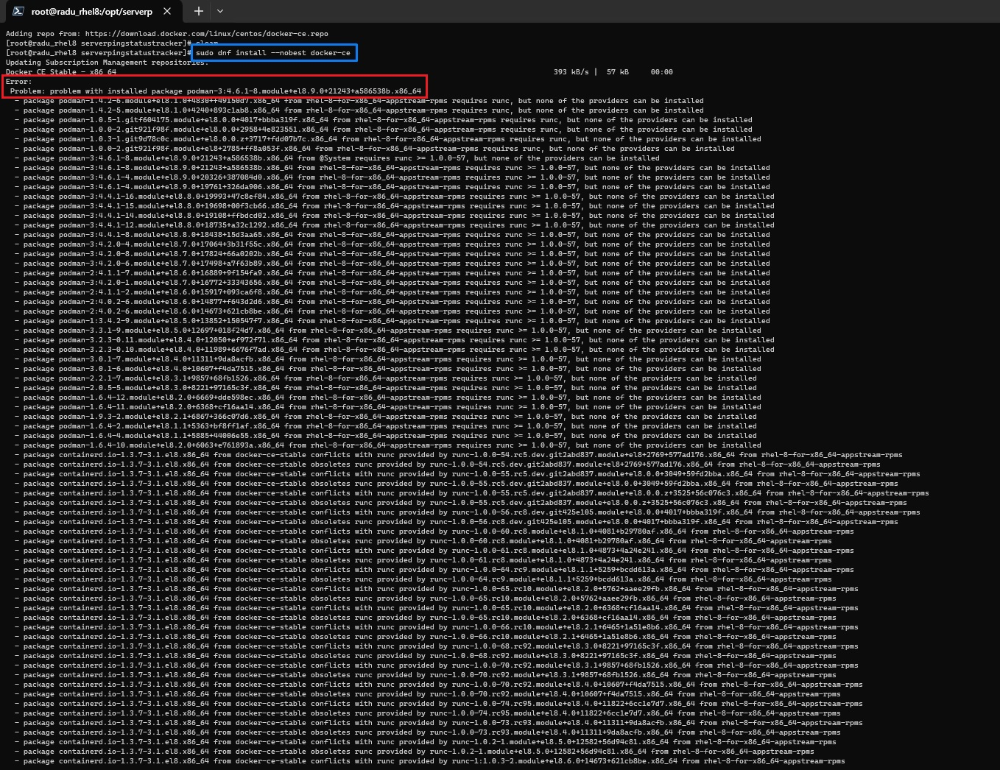

# Running docker compose on RedHat 8.9 Virtual Machine

Table of Contents:

- [Running docker compose on RedHat 8.9 Virtual Machine](#running-docker-compose-on-redhat-89-virtual-machine)
  - [Enabling root login over SSH](#enabling-root-login-over-ssh)
  - [Downloading git and cloning serverpingstatustracker app](#downloading-git-and-cloning-serverpingstatustracker-app)
- [Docker and Docker Compose](#docker-and-docker-compose)
  - [Download Docker from external Docker Repository using DNF](#download-docker-from-external-docker-repository-using-dnf)
  - [Download Docker from external Docker Repository using YUM](#download-docker-from-external-docker-repository-using-yum)
    - [Install docker-compose globally](#install-docker-compose-globally)
  - [Running docker compose up](#running-docker-compose-up)

<br/>

Resources:

- Check my Study Notes on Linux:
  - [Install Windows Subsystem for Linux (WSL) and Learn these first basic Linux commands](https://github.com/radualexandrub/Study/blob/master/Linux/WSL-Tutorial-and-Linux-Commands.md)
  - [The Most Popular Linux & Terminal Commands](https://github.com/radualexandrub/Study/blob/master/Linux/Top-Linux-Commands.md)

<br/>
<hr/>

Note: We can download an install RHEL 8.9 from https://developers.redhat.com/products/rhel/download (Installation type will be as a Server with no GUI).

We can then run the RedHat 8.9 VM in Windows via "Hyper-V Manager" builtin application.

<br/>

After installation, we can run the following to find out the RedHat version:

```bash
cat /etc/redhat-release
# Red Hat Enterprise Linux release 8.9 (Ootpa)

date
# Mon Feb 26 14:25:35 EST 2024

hostname
# radu_rhel8
# Note: we can change our hostname with "nmtui"
```

<br/>

We can check allocated storage by running:

```bash
df -h /
# Filesystem             Size  Used Avail Use% Mounted on
# /dev/mapper/rhel-root   70G  3.1G   67G   5% /

du -sh /*
# 0       /bin
# 191M    /boot
# 0       /dev
# 29M     /etc
# 0       /home
# 0       /lib
# 0       /lib64
# 0       /media
# 0       /mnt
# 0       /opt
# 0       /proc
# 24K     /root
# 8.5M    /run
# 0       /sbin
# 0       /srv
# 0       /sys
# 24K     /tmp
# 2.1G    /usr
# 396M    /var

du -sh /var/* | sort
# 0       /var/account
# 0       /var/adm
# 0       /var/crash
# 0       /var/db
# 0       /var/empty
# 0       /var/ftp
# 0       /var/games
# 0       /var/gopher
# 0       /var/kerberos
# 0       /var/local
# 0       /var/lock
# 0       /var/mail
# 0       /var/nis
# 0       /var/opt
# 0       /var/preserve
# 0       /var/run
# 0       /var/spool
# 0       /var/tmp
# 0       /var/yp
# 149M    /var/lib
# 241M    /var/cache
# 5.9M    /var/log
```

<br/>

We can also see a list of repositories by running:

```bash
yum -v repolist

Loaded plugins: builddep, changelog, config-manager, copr, debug, debuginfo-install, download, generate_completion_cache, groups-manager, kpatch, needs-restarting, playground, product-id, repoclosure, repodiff, repograph, repomanage, reposync, subscription-manager, system-upgrade, uploadprofile

Updating Subscription Management repositories.
YUM version: 4.7.0
cachedir: /var/cache/dnf

Red Hat Enterprise Linux 8 for x86_64 - AppStream (RPMs)    24 MB/s |  59 MB     00:02
Red Hat Enterprise Linux 8 for x86_64 - BaseOS (RPMs)       25 MB/s |  66 MB     00:02

Last metadata expiration check: 0:00:09 ago on Mon 26 Feb 2024 02:30:18 PM EST.
Repo-id            : rhel-8-for-x86_64-appstream-rpms
Repo-name          : Red Hat Enterprise Linux 8 for x86_64 - AppStream (RPMs)
Repo-revision      : 1708954604
Repo-updated       : Mon 26 Feb 2024 08:36:43 AM EST
Repo-pkgs          : 35,696
Repo-available-pkgs: 31,052
Repo-size          : 114 G
Repo-baseurl       : https://cdn.redhat.com/content/dist/rhel8/8/x86_64/appstream/os
Repo-expire        : 86,400 second(s) (last: Mon 26 Feb 2024 02:30:05 PM EST)
Repo-filename      : /etc/yum.repos.d/redhat.repo

Repo-id            : rhel-8-for-x86_64-baseos-rpms
Repo-name          : Red Hat Enterprise Linux 8 for x86_64 - BaseOS (RPMs)
Repo-revision      : 1708912356
Repo-updated       : Sun 25 Feb 2024 08:52:35 PM EST
Repo-pkgs          : 15,849
Repo-available-pkgs: 15,843
Repo-size          : 29 G
Repo-baseurl       : https://cdn.redhat.com/content/dist/rhel8/8/x86_64/baseos/os
Repo-expire        : 86,400 second(s) (last: Mon 26 Feb 2024 02:30:18 PM EST)
Repo-filename      : /etc/yum.repos.d/redhat.repo
Total packages: 51,545
```

https://www.cyberciti.biz/faq/centos-fedora-redhat-yum-repolist-command-tolist-package-repositories/

https://access.redhat.com/documentation/en-us/red_hat_enterprise_linux/6/html/deployment_guide/sec-configuring_yum_and_yum_repositories

<br/>

## Enabling root login over SSH

https://access.redhat.com/documentation/en-us/red_hat_enterprise_linux/6/html/deployment_guide/s2-ssh-configuration-sshd

```bash
service sshd start
```

Edit the following file

```bash
vi /etc/ssh/sshd_config
```

Uncommnent the line `PermitRootLogin yes` and save the updated file (ESC + `:wq!`)

Restart SSH serverr

```bash
service sshd restart
```

<br/>

Now, from Windows/Terminal, we should be able to login `ssh root@<RHEL_VM_IpAddress>`. Note that you can find the VM's IpAddress by running `ip addr show eth0`

<br/>

## Downloading git and cloning serverpingstatustracker app

(Thursday, February 29, 2024, 22:00)

We can download and install `git` via [YUM Package Manager](https://www.redhat.com/sysadmin/how-manage-packages) directly from the RHEL repository by running:

```bash
yum install git
```



```bash
git -v
# git version 2.39.3

rpm -qa | grep "git-"
# git-core-2.39.3-1.el8_8.x86_64
# git-core-doc-2.39.3-1.el8_8.noarch
# git-2.39.3-1.el8_8.x86_64
```

<br/>

Now we can download the application that we want to run withing Docker!

Example: https://github.com/radualexandrub/SpringBoot-Angular-Server-Ping-Status-Tracker

```bash
cd /opt
git clone https://github.com/radualexandrub/SpringBoot-Angular-Server-Ping-Status-Tracker serverpingstatustracker
cd serverpingstatustracker
```



<br/>

# Docker and Docker Compose

Note: We will try to download Docker **without** using RHEL's YUM repository. This is because, since RedHat 8 (including RedHat 9), Docker is no longer preinstalled/available, and instead, `Podman` is now the default/alternative container engine.

We can check if the Docker package is available through the RHEL's YUM repositorys by running the following (source: [check-available-package-yum](https://linuxhint.com/check-available-package-yum/))

```bash
sudo yum list available | grep docker
# pcp-pmda-docker.x86_64   5.3.7-18.el8                             rhel-8-for-x86_64-appstream-rpms
# podman-docker.noarch     3:4.6.1-8.module+el8.9.0+21243+a586538b  rhel-8-for-x86_64-appstream-rpms
```

We can see that we have no Docker package that we can use.

However, if we run any **podman** commands, we can see that it is available (without `compose`...):

```bash
podman --version
# podman version 4.6.1

podman compose
# Error: unrecognized command `podman compose`
# Try 'podman --help' for more information

podman-compose
# -bash: podman-compose: command not found
```

```bash
sudo yum list available | grep podman
# pcp-pmda-podman.x86_64   5.3.7-18.el8                                       rhel-8-for-x86_64-appstream-rpms
# podman-docker.noarch     3:4.6.1-8.module+el8.9.0+21243+a586538b            rhel-8-for-x86_64-appstream-rpms
# podman-manpages.noarch   1.6.4-4.module+el8.1.1+5885+44006e55               rhel-8-for-x86_64-appstream-rpms
# podman-remote.x86_64     3:4.6.1-8.module+el8.9.0+21243+a586538b            rhel-8-for-x86_64-appstream-rpms
# podman-tests.x86_64      3:4.6.1-8.module+el8.9.0+21243+a586538b            rhel-8-for-x86_64-appstream-rpms
# python-podman-api.noarch 1.2.0-0.2.gitd0a45fe.module+el8.3.1+9857+68fb1526  rhel-8-for-x86_64-appstream-rpms
# python3-podman.noarch    4.6.0-2.module+el8.9.0+21243+a586538b              rhel-8-for-x86_64-appstream-rpms
```

<Br/>

## Download Docker from external Docker Repository using DNF

🔴 IT DID NOT WORK 2024-02-29

Source: https://help.hcltechsw.com/bigfix/10.0/mcm/MCM/Install/install_docker_ce_docker_compose_on_rhel_8.html

We can run the following command to add the official Docker Repository https://download.docker.com/linux/centos/docker-ce.repo:

> Note that the contents of `docker-ce.repo` file (as of 2024-02-29) is:
>
> ```bash
> [docker-ce-stable]
> name=Docker CE Stable - $basearch
> baseurl=https://download.docker.com/linux/centos/$releasever/$basearch/stable
> enabled=1
> gpgcheck=1
> gpgkey=https://download.docker.com/linux/centos/gpg
>
> [docker-ce-stable-debuginfo]
> name=Docker CE Stable - Debuginfo $basearch
> baseurl=https://download.docker.com/linux/centos/$releasever/debug-$basearch/stable
> enabled=0
> gpgcheck=1
> gpgkey=https://download.docker.com/linux/centos/gpg
>
> [docker-ce-stable-source]
> name=Docker CE Stable - Sources
> baseurl=https://download.docker.com/linux/centos/$releasever/source/stable
> enabled=0
> gpgcheck=1
> gpgkey=https://download.docker.com/linux/centos/gpg
>
> [docker-ce-test]
> name=Docker CE Test - $basearch
> baseurl=https://download.docker.com/linux/centos/$releasever/$basearch/test
> enabled=0
> gpgcheck=1
> gpgkey=https://download.docker.com/linux/centos/gpg
>
> [docker-ce-test-debuginfo]
> name=Docker CE Test - Debuginfo $basearch
> baseurl=https://download.docker.com/linux/centos/$releasever/debug-$basearch/test
> enabled=0
> gpgcheck=1
> gpgkey=https://download.docker.com/linux/centos/gpg
>
> [docker-ce-test-source]
> name=Docker CE Test - Sources
> baseurl=https://download.docker.com/linux/centos/$releasever/source/test
> enabled=0
> gpgcheck=1
> gpgkey=https://download.docker.com/linux/centos/gpg
>
> [docker-ce-nightly]
> name=Docker CE Nightly - $basearch
> baseurl=https://download.docker.com/linux/centos/$releasever/$basearch/nightly
> enabled=0
> gpgcheck=1
> gpgkey=https://download.docker.com/linux/centos/gpg
>
> [docker-ce-nightly-debuginfo]
> name=Docker CE Nightly - Debuginfo $basearch
> baseurl=https://download.docker.com/linux/centos/$releasever/debug-$basearch/nightly
> enabled=0
> gpgcheck=1
> gpgkey=https://download.docker.com/linux/centos/gpg
>
> [docker-ce-nightly-source]
> name=Docker CE Nightly - Sources
> baseurl=https://download.docker.com/linux/centos/$releasever/source/nightly
> enabled=0
> gpgcheck=1
> gpgkey=https://download.docker.com/linux/centos/gpg
> ```
>
> In our RedHat 8.9 environment, we can find the `$releasever` and `$basearch` variables by running from https://unix.stackexchange.com/questions/19701/> yum-how-can-i-view-variables-like-releasever-basearch-yum0
>
> ```bash
> # RHEL/CentOS 6 and 7
> python -c 'import yum, json; yb = yum.YumBase(); print json.dumps(yb.conf.yumvar, indent=2)'
>
>
> # RHEL/CentOS 8:
> /usr/libexec/platform-python -c 'import dnf, json; db = dnf.dnf.Base(); print(json.dumps(db.conf.substitutions, indent=2))'
> {
>   "arch": "x86_64",
>   "basearch": "x86_64",
>   "releasever": "8"
> }
> ```
>
> For example, the repository URL where Docker will be downloaded from will look like this: https://download.docker.com/linux/centos/8/x86_64/stable

<br/>

```bash
sudo dnf config-manager --add-repo=https://download.docker.com/linux/centos/docker-ce.repo
# Updating Subscription Management repositories.
# Adding repo from: https://download.docker.com/linux/centos/docker-ce.repo
```

Install docker-ce with the `--nobest` option: the first version of `docker-ce` with satisfiable dependencies is selected as the "fallback" version.

```bash
sudo dnf install --nobest docker-ce
```

That didn't seem to work...

```bash
Error:
 Problem: problem with installed package podman-3:4.6.1-8.module+el8.9.0+21243+a586538b.x86_64
  - package podman-1.4.2-6.module+el8.1.0+4830+f49150d7.x86_64 from rhel-8-for-x86_64-appstream-rpms requires runc, but none of the providers can be installed
...
  - package docker-ce-3:25.0.3-1.el8.x86_64 from docker-ce-stable requires containerd.io >= 1.6.24, but none of the providers can be installed
(try to add '--allowerasing' to command line to replace conflicting packages or '--skip-broken' to skip uninstallable packages)
```



<br/>

Let's try to install the latest available containerd.io package manually?... But it will still not work...

```bash
sudo dnf install https://download.docker.com/linux/centos/8/x86_64/stable/Packages/containerd.io-1.6.9-3.1.el8.x86_64.rpm

Updating Subscription Management repositories.
Last metadata expiration check: 0:06:29 ago on Thu 29 Feb 2024 04:17:26 PM EST.
containerd.io-1.6.9-3.1.el8.x86_64.rpm                                                                                                                                                                       40 MB/s |  33 MB     00:00
Error:
 Problem: problem with installed package buildah-1:1.31.3-3.module+el8.9.0+21243+a586538b.x86_64
  - package buildah-1:1.31.3-3.module+el8.9.0+21243+a586538b.x86_64 from @System requires runc >= 1.0.0-26, but none of the providers can be installed
...
  - package runc-1:1.1.12-1.module+el8.9.0+21242+944321bb.x86_64 from rhel-8-for-x86_64-appstream-rpms is filtered out by modular filtering
(try to add '--allowerasing' to command line to replace conflicting packages or '--skip-broken' to skip uninstallable packages or '--nobest' to use not only best candidate packages)
```

<br/>

## Download Docker from external Docker Repository using YUM

https://help.hcltechsw.com/bigfix/10.0/mcm/MCM/Install/install_docker_ce_docker_compose_on_rhel_8.html

```bash
sudo yum config-manager --add-repo=https://download.docker.com/linux/centos/docker-ce.repo
# Updating Subscription Management repositories.
# Adding repo from: https://download.docker.com/linux/centos/docker-ce.repo
```

```bash
sudo yum -y install docker-ce --allowerasing
```

```
Updating Subscription Management repositories.
Docker CE Stable - x86_64                                                                                                                                                                                    54 kB/s | 3.5 kB     00:00
Dependencies resolved.
============================================================================================================================================================================================================================================
 Package                                                 Architecture                         Version                                                                 Repository                                                       Size
============================================================================================================================================================================================================================================
Installing:
 docker-ce                                               x86_64                               3:25.0.3-1.el8                                                          docker-ce-stable                                                 26 M
Installing dependencies:
 containerd.io                                           x86_64                               1.6.28-3.1.el8                                                          docker-ce-stable                                                 35 M
     replacing  runc.x86_64 1:1.1.12-1.module+el8.9.0+21243+a586538b
 crun                                                    x86_64                               1.8.7-1.module+el8.9.0+21243+a586538b                                   rhel-8-for-x86_64-appstream-rpms                                239 k
 docker-ce-cli                                           x86_64                               1:25.0.3-1.el8                                                          docker-ce-stable                                                7.3 M
 libcgroup                                               x86_64                               0.41-19.el8                                                             rhel-8-for-x86_64-baseos-rpms                                    70 k
 yajl                                                    x86_64                               2.1.0-12.el8                                                            rhel-8-for-x86_64-appstream-rpms                                 41 k
Installing weak dependencies:
 criu-libs                                               x86_64                               3.18-4.module+el8.9.0+21243+a586538b                                    rhel-8-for-x86_64-appstream-rpms                                 39 k
 docker-buildx-plugin                                    x86_64                               0.12.1-1.el8                                                            docker-ce-stable                                                 13 M
 docker-ce-rootless-extras                               x86_64                               25.0.3-1.el8                                                            docker-ce-stable                                                5.0 M
 docker-compose-plugin                                   x86_64                               2.24.6-1.el8                                                            docker-ce-stable                                                 13 M
Removing dependent packages:
 buildah                                                 x86_64                               1:1.31.3-3.module+el8.9.0+21243+a586538b                                @rhel-8-for-x86_64-appstream-rpms                                29 M
 cockpit-podman                                          noarch                               75-1.module+el8.9.0+21243+a586538b                                      @rhel-8-for-x86_64-appstream-rpms                               740 k
 podman                                                  x86_64                               3:4.6.1-8.module+el8.9.0+21243+a586538b                                 @rhel-8-for-x86_64-appstream-rpms                                50 M
 podman-catatonit                                        x86_64                               3:4.6.1-8.module+el8.9.0+21243+a586538b                                 @rhel-8-for-x86_64-appstream-rpms                               765 k
Downgrading:
 containers-common                                       x86_64                               1:1.2.2-10.module+el8.4.0+11311+9da8acfb                                rhel-8-for-x86_64-appstream-rpms                                 99 k

Transaction Summary
============================================================================================================================================================================================================================================
Install    10 Packages
Remove      4 Packages
Downgrade   1 Package

Total download size: 100 M
Downloading Packages:
(1/11): docker-buildx-plugin-0.12.1-1.el8.x86_64.rpm                                                                                                                                                         17 MB/s |  13 MB     00:00
(2/11): containers-common-1.2.2-10.module+el8.4.0+11311+9da8acfb.x86_64.rpm                                                                                                                                  92 kB/s |  99 kB     00:01
(3/11): docker-ce-cli-25.0.3-1.el8.x86_64.rpm                                                                                                                                                                15 MB/s | 7.3 MB     00:00
(4/11): docker-ce-25.0.3-1.el8.x86_64.rpm                                                                                                                                                                    25 MB/s |  26 MB     00:01
(5/11): docker-ce-rootless-extras-25.0.3-1.el8.x86_64.rpm                                                                                                                                                    16 MB/s | 5.0 MB     00:00
(6/11): containerd.io-1.6.28-3.1.el8.x86_64.rpm                                                                                                                                                              18 MB/s |  35 MB     00:01
(7/11): yajl-2.1.0-12.el8.x86_64.rpm                                                                                                                                                                        117 kB/s |  41 kB     00:00
(8/11): docker-compose-plugin-2.24.6-1.el8.x86_64.rpm                                                                                                                                                        31 MB/s |  13 MB     00:00
(9/11): crun-1.8.7-1.module+el8.9.0+21243+a586538b.x86_64.rpm                                                                                                                                               860 kB/s | 239 kB     00:00
(10/11): criu-libs-3.18-4.module+el8.9.0+21243+a586538b.x86_64.rpm                                                                                                                                           66 kB/s |  39 kB     00:00
(11/11): libcgroup-0.41-19.el8.x86_64.rpm                                                                                                                                                                   186 kB/s |  70 kB     00:00
--------------------------------------------------------------------------------------------------------------------------------------------------------------------------------------------------------------------------------------------
Total                                                                                                                                                                                                        38 MB/s | 100 MB     00:02
Docker CE Stable - x86_64                                                                                                                                                                                    61 kB/s | 1.6 kB     00:00
Importing GPG key 0x621E9F35:
 Userid     : "Docker Release (CE rpm) <docker@docker.com>"
 Fingerprint: 060A 61C5 1B55 8A7F 742B 77AA C52F EB6B 621E 9F35
 From       : https://download.docker.com/linux/centos/gpg
Key imported successfully
Running transaction check
Transaction check succeeded.
Running transaction test
Transaction test succeeded.
Running transaction
  Preparing        :                                                                                                                                                                                                                    1/1
  Running scriptlet: docker-compose-plugin-2.24.6-1.el8.x86_64                                                                                                                                                                          1/1
  Installing       : docker-compose-plugin-2.24.6-1.el8.x86_64                                                                                                                                                                         1/17
  Running scriptlet: docker-compose-plugin-2.24.6-1.el8.x86_64                                                                                                                                                                         1/17
  Running scriptlet: libcgroup-0.41-19.el8.x86_64                                                                                                                                                                                      2/17
  Installing       : libcgroup-0.41-19.el8.x86_64                                                                                                                                                                                      2/17
  Running scriptlet: libcgroup-0.41-19.el8.x86_64                                                                                                                                                                                      2/17
  Installing       : criu-libs-3.18-4.module+el8.9.0+21243+a586538b.x86_64                                                                                                                                                             3/17
  Installing       : yajl-2.1.0-12.el8.x86_64                                                                                                                                                                                          4/17
  Installing       : crun-1.8.7-1.module+el8.9.0+21243+a586538b.x86_64                                                                                                                                                                 5/17
  Installing       : docker-buildx-plugin-0.12.1-1.el8.x86_64                                                                                                                                                                          6/17
  Running scriptlet: docker-buildx-plugin-0.12.1-1.el8.x86_64                                                                                                                                                                          6/17
  Installing       : docker-ce-cli-1:25.0.3-1.el8.x86_64                                                                                                                                                                               7/17
  Running scriptlet: docker-ce-cli-1:25.0.3-1.el8.x86_64                                                                                                                                                                               7/17
  Installing       : containerd.io-1.6.28-3.1.el8.x86_64                                                                                                                                                                               8/17
  Running scriptlet: containerd.io-1.6.28-3.1.el8.x86_64                                                                                                                                                                               8/17
  Installing       : docker-ce-rootless-extras-25.0.3-1.el8.x86_64                                                                                                                                                                     9/17
  Running scriptlet: docker-ce-rootless-extras-25.0.3-1.el8.x86_64                                                                                                                                                                     9/17
  Installing       : docker-ce-3:25.0.3-1.el8.x86_64                                                                                                                                                                                  10/17
  Running scriptlet: docker-ce-3:25.0.3-1.el8.x86_64                                                                                                                                                                                  10/17
  Downgrading      : containers-common-1:1.2.2-10.module+el8.4.0+11311+9da8acfb.x86_64                                                                                                                                                11/17
  Erasing          : buildah-1:1.31.3-3.module+el8.9.0+21243+a586538b.x86_64                                                                                                                                                          12/17
  Erasing          : cockpit-podman-75-1.module+el8.9.0+21243+a586538b.noarch                                                                                                                                                         13/17
  Running scriptlet: podman-3:4.6.1-8.module+el8.9.0+21243+a586538b.x86_64                                                                                                                                                            14/17
  Erasing          : podman-3:4.6.1-8.module+el8.9.0+21243+a586538b.x86_64                                                                                                                                                            14/17
  Running scriptlet: podman-3:4.6.1-8.module+el8.9.0+21243+a586538b.x86_64                                                                                                                                                            14/17
  Cleanup          : containers-common-2:1-71.module+el8.9.0+21243+a586538b.x86_64                                                                                                                                                    15/17
  Erasing          : podman-catatonit-3:4.6.1-8.module+el8.9.0+21243+a586538b.x86_64                                                                                                                                                  16/17
  Running scriptlet: podman-catatonit-3:4.6.1-8.module+el8.9.0+21243+a586538b.x86_64                                                                                                                                                  16/17
  Obsoleting       : runc-1:1.1.12-1.module+el8.9.0+21243+a586538b.x86_64                                                                                                                                                             17/17
  Running scriptlet: runc-1:1.1.12-1.module+el8.9.0+21243+a586538b.x86_64                                                                                                                                                             17/17
  Verifying        : containers-common-1:1.2.2-10.module+el8.4.0+11311+9da8acfb.x86_64                                                                                                                                                 1/17
  Verifying        : containers-common-2:1-71.module+el8.9.0+21243+a586538b.x86_64                                                                                                                                                     2/17
  Verifying        : containerd.io-1.6.28-3.1.el8.x86_64                                                                                                                                                                               3/17
  Verifying        : runc-1:1.1.12-1.module+el8.9.0+21243+a586538b.x86_64                                                                                                                                                              4/17
  Verifying        : docker-buildx-plugin-0.12.1-1.el8.x86_64                                                                                                                                                                          5/17
  Verifying        : docker-ce-3:25.0.3-1.el8.x86_64                                                                                                                                                                                   6/17
  Verifying        : docker-ce-cli-1:25.0.3-1.el8.x86_64                                                                                                                                                                               7/17
  Verifying        : docker-ce-rootless-extras-25.0.3-1.el8.x86_64                                                                                                                                                                     8/17
  Verifying        : docker-compose-plugin-2.24.6-1.el8.x86_64                                                                                                                                                                         9/17
  Verifying        : yajl-2.1.0-12.el8.x86_64                                                                                                                                                                                         10/17
  Verifying        : criu-libs-3.18-4.module+el8.9.0+21243+a586538b.x86_64                                                                                                                                                            11/17
  Verifying        : crun-1.8.7-1.module+el8.9.0+21243+a586538b.x86_64                                                                                                                                                                12/17
  Verifying        : libcgroup-0.41-19.el8.x86_64                                                                                                                                                                                     13/17
  Verifying        : buildah-1:1.31.3-3.module+el8.9.0+21243+a586538b.x86_64                                                                                                                                                          14/17
  Verifying        : cockpit-podman-75-1.module+el8.9.0+21243+a586538b.noarch                                                                                                                                                         15/17
  Verifying        : podman-3:4.6.1-8.module+el8.9.0+21243+a586538b.x86_64                                                                                                                                                            16/17
  Verifying        : podman-catatonit-3:4.6.1-8.module+el8.9.0+21243+a586538b.x86_64                                                                                                                                                  17/17
Installed products updated.

Downgraded:
  containers-common-1:1.2.2-10.module+el8.4.0+11311+9da8acfb.x86_64
Installed:
  containerd.io-1.6.28-3.1.el8.x86_64     criu-libs-3.18-4.module+el8.9.0+21243+a586538b.x86_64     crun-1.8.7-1.module+el8.9.0+21243+a586538b.x86_64     docker-buildx-plugin-0.12.1-1.el8.x86_64     docker-ce-3:25.0.3-1.el8.x86_64
  docker-ce-cli-1:25.0.3-1.el8.x86_64     docker-ce-rootless-extras-25.0.3-1.el8.x86_64             docker-compose-plugin-2.24.6-1.el8.x86_64             libcgroup-0.41-19.el8.x86_64                 yajl-2.1.0-12.el8.x86_64
Removed:
  buildah-1:1.31.3-3.module+el8.9.0+21243+a586538b.x86_64  cockpit-podman-75-1.module+el8.9.0+21243+a586538b.noarch  podman-3:4.6.1-8.module+el8.9.0+21243+a586538b.x86_64  podman-catatonit-3:4.6.1-8.module+el8.9.0+21243+a586538b.x86_64

Complete!
```

<br/>

I guess the downloading and installing of Docker worked?

Now we can start and enable the docker daemon

```bash
sudo systemctl enable --now docker
# Created symlink /etc/systemd/system/multi-user.target.wants/docker.service → /usr/lib/systemd/system/docker.service.
```

Check if docker daemon is active ✅:

```bash
systemctl is-active docker
# active
```

<br/>

Let's quickly check the Docker CE (Community Edition) versions that we have installed:

```bash
sudo yum list installed | grep "docker"
# containerd.io.x86_64               1.6.28-3.1.el8   @docker-ce-stable
# docker-buildx-plugin.x86_64        0.12.1-1.el8     @docker-ce-stable
# docker-ce.x86_64                   3:25.0.3-1.el8   @docker-ce-stable
# docker-ce-cli.x86_64               1:25.0.3-1.el8   @docker-ce-stable
# docker-ce-rootless-extras.x86_64   25.0.3-1.el8     @docker-ce-stable
# docker-compose-plugin.x86_64       2.24.6-1.el8     @docker-ce-stable
```

```bash
rpm -qa | grep "docker"
# docker-buildx-plugin-0.12.1-1.el8.x86_64
# docker-ce-25.0.3-1.el8.x86_64
# docker-compose-plugin-2.24.6-1.el8.x86_64
# docker-ce-cli-25.0.3-1.el8.x86_64
# docker-ce-rootless-extras-25.0.3-1.el8.x86_64
```

```bash
docker -v
# Docker version 25.0.3, build 4debf41

docker compose version
# Docker Compose version v2.24.6
```

Hmm, interesting, it seems that we already installed the `docker compose` plugin.

<br/>

### Install docker-compose globally

🔴 NOTE: I don't think this step is any longer needed since we can already run `docker compose` (without the dash `-`), which is a newer version of docker compose.

🔴 NO NEED TO INSTALL FURTHER FROM [HERE](https://help.hcltechsw.com/bigfix/10.0/mcm/MCM/Install/install_docker_ce_docker_compose_on_rhel_8.html)

```bash
### TO BE IGNORED:

# Download the `docker-compose` binary file from the project’s GitHub page:
curl -L "https://github.com/docker/compose/releases/download/1.23.2/docker-compose-$(uname -s)-$(uname -m)" -o docker-compose

# After the binary file is downloaded, move it to the /usr/local/bin folder, and then make it executable:
sudo mv docker-compose /usr/local/bin && sudo chmod +x /usr/local/bin/docker-compose
sudo ln -s /usr/local/bin/docker-compose /usr/bin/docker-compose
```

<br/>

## Running docker compose up

Running `docker compose up` in our application folder will successfully start all the services defined in the docker-compose.yml file:

```bash
cd /opt/serverpingstatustracker
docker compose up
```
