Table of Contents (ToC):

- [Theory on switch types](#theory-on-switch-types)
  - [Private Switch](#private-switch)
  - [Internal Switch](#internal-switch)
  - [Default Switch - NAT Network](#default-switch---nat-network)
  - [External Switch](#external-switch)
- [Setting VMs environment using Windows Hyper-V Manager to run the app](#setting-vms-environment-using-windows-hyper-v-manager-to-run-the-app)
  - [Running the app on CentOS8](#running-the-app-on-centos8)
  - [Running the app on RHEL8 with Docker](#running-the-app-on-rhel8-with-docker)
- [Load Balancer using Default Switch](#load-balancer-using-default-switch)
  - [Installing another RHEL9.2 VM](#installing-another-rhel92-vm)
  - [Installing Nginx on RHEL8 or RHEL9](#installing-nginx-on-rhel8-or-rhel9)
  - [Configuring Nginx Load Balancer on RHEL9.2 VM](#configuring-nginx-load-balancer-on-rhel92-vm)
  - [Load Balancer and VMs Schema on Default Switch](#load-balancer-and-vms-schema-on-default-switch)
- [Load Balancer using External Switch](#load-balancer-using-external-switch)
  - [Installing Nginx on Raspberry Pi 4](#installing-nginx-on-raspberry-pi-4)
    - [Optional Creating and testing a simple Nginx Web Server on Raspberry Pi](#optional-creating-and-testing-a-simple-nginx-web-server-on-raspberry-pi)
  - [Creating an External Switch on Windows Hyper-V Manager](#creating-an-external-switch-on-windows-hyper-v-manager)
  - [Testing connection between VMs, Host, and External Devices](#testing-connection-between-vms-host-and-external-devices)
  - [Configuring Nginx Load Balancer on Raspbian OS (Debian)](#configuring-nginx-load-balancer-on-raspbian-os-debian)
  - [Load Balancer and VMs Schema on External Switch](#load-balancer-and-vms-schema-on-external-switch)

<br/>

Check my other tutorials/notes at:

- [Load Balancer using Nginx](https://github.com/radualexandrub/Study/blob/master/Linux/LoadBalancerNginx.md)
- [Running the application without Docker on CentOS 8 VM](./README_CentOS8.md)
- [Running the application with docker compose on RedHat 8.9 VM](./README_Docker_RedHat.md)

<br/>

# Theory on switch types

(Notes first created on Tuesday, April 16, 2024, 19:05)

Resources used:

- [Managing and Configuring Hyper-V Virtual Switches -- Default, Internal, External, and Private - Troy Berg - 42m - 22-Feb-2022](https://www.youtube.com/watch?v=jdk6xCNmydU)
- [Hyper V Network Configuration: Virtual Switch Manager - syncbrick - 9m - 13-Apr-2023](https://www.youtube.com/watch?v=kHXxNQaiapw&list=LL&index=5)
- [Creating a Hyper-V virtual switch - David Dalton - 7m - 29-Sept-2021](https://www.youtube.com/watch?v=Vw8wn8WgbHE)

<br/>

Terminology across different virtulization platforms:

| Hyper-V         | Oracle VirtualBox                         | VMware (vSphere Client)                                | Proxmox |
| --------------- | ----------------------------------------- | ------------------------------------------------------ | ------- |
| Private Switch  | Internal Network                          | Portgroup (Distributed vSwitch with no uplink adapter) | -       |
| Internal Switch | - (Host-Only Networking)                  | -                                                      | -       |
| Default Switch  | NAT (Network Address Translation) Network | Standard vSwitch                                       | Bridge  |
| External Switch | Bridged Network                           | Distributed vSwitch with an uplink adapter             | Bridge  |

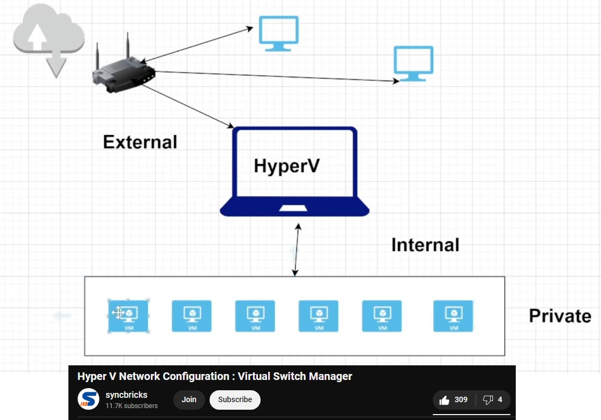

<br/>

## Private Switch

- The private switch in Hyper-V creates an isolated virtual network that only the virtual machines on the host can communicate among themselves (they cannot talk to the local area network or the Internet).

- The Host PC/Laptop and other devices on the external network cannot communicate with the virtual machines connected to the private switch.

- This type of network is useful for scenarios where you want to create a closed network environment for testing or development purposes (without affecting any device in the main LAN environment).

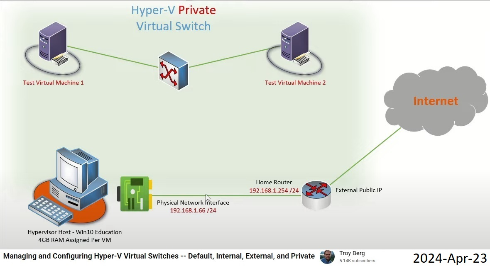

<br/>

To create a private switch in Hyper-V, go to **Hyper-V Manager** > **Virtual Switch Manager** > **Create Virtual Switch** > **Private Switch**:

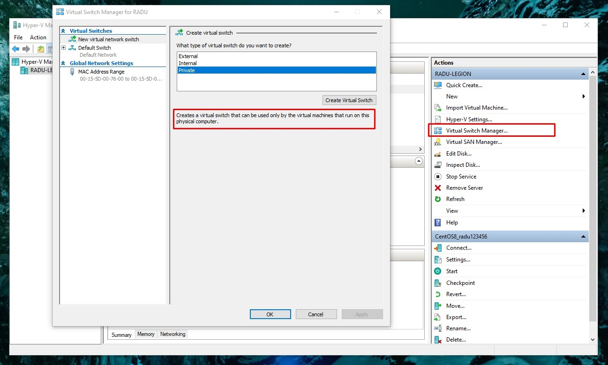

Then, assign the new created private switch to each VM by going to **Hyper-V Manager** > **Virtual Machines** > **YourVirtualMachineName** > **Right Click** > **Settings...** > **Network Adapter** > **Select Virtual Switch from dropdown list**:

Then, on each VM, we need to assign to itself (to its network adapted) and IPv4 Address.

- For example, on Windows VMs, go to "Network and Internet Settings" > "Change Adapter Settings" > "Ethernet" > "Properties" > "Internet Protocol Version 4 (TCP/IPv4)" > Check "Use the following IP address" > It can be a simple address such as "10.10.10.1" with a Subnet mask of "255.255.255.0" (with no default gateway address, as the VMs will not have an outside connectivity). Run CMD Prompt command "ipconfig".

<br/>

## Internal Switch

- An internal switch in Hyper-V also creates an isolated network, similar to the private switch.

- Communication is restricted to the virtual machines hosted on the laptop/PC and the laptop/PC itself. Devices on the external network cannot communicate with the virtual machines connected to the internal switch.

- The difference between the internal switch and the private switch lies in how they handle communication with the host machine (our laptop in this case). With the internal switch, the host machine can communicate with the virtual machines on the same switch.

- **The host machine can have an address assigned on that virtual internal network.**

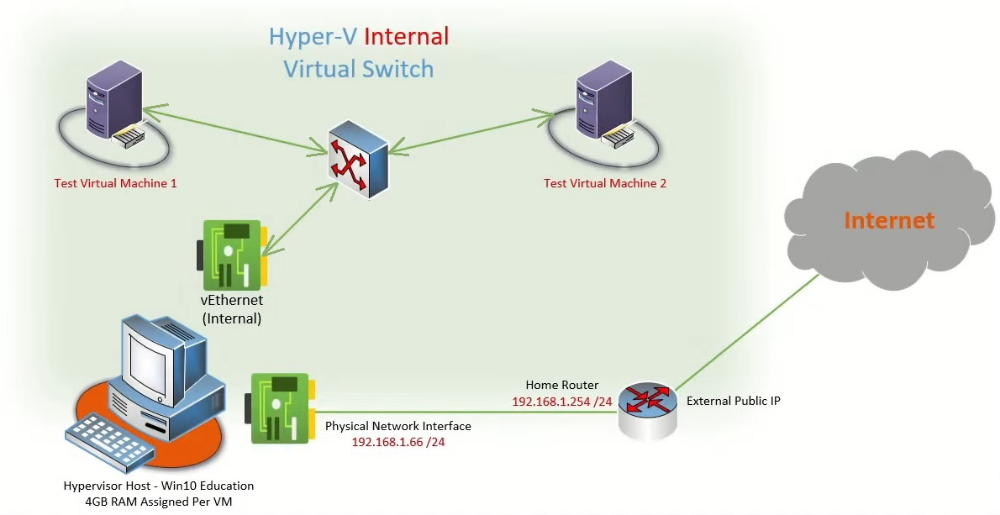

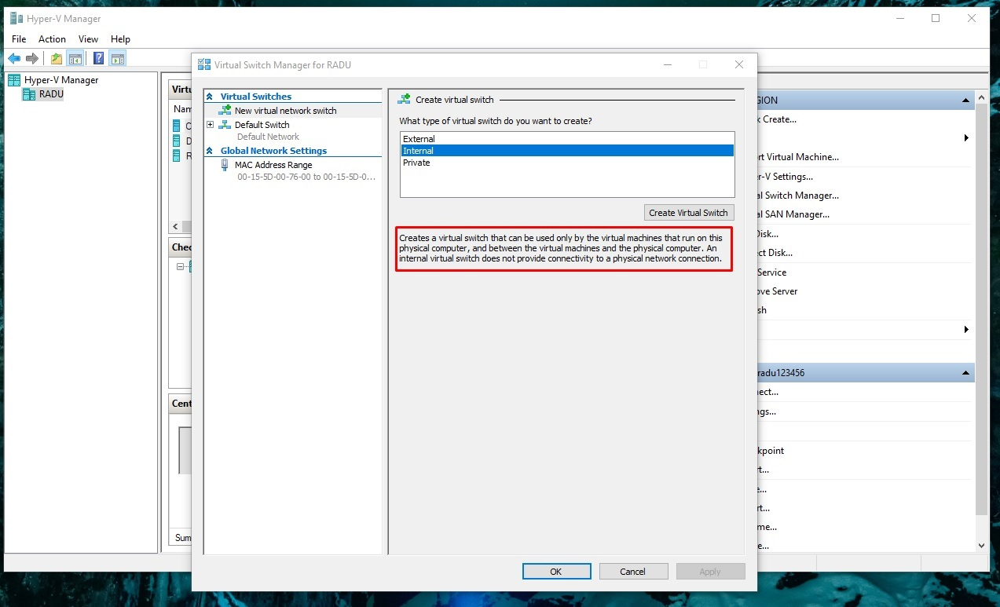

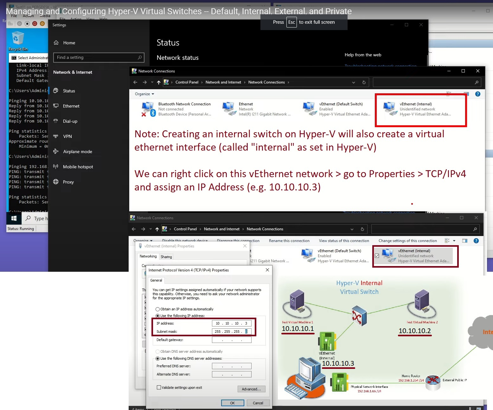

<br/>

## Default Switch - NAT Network

- The default switch in Hyper-V is typically configured as a NAT network. This means that the virtual machines connected to this switch will share the host's IP address for outbound connections.

- Communication between the virtual machines and devices on the external network (your local area network) is possible because the default switch performs **NAT (Network Address Translation)**. Outbound traffic from the virtual machines is translated by the default switch to appear as if it originated from the host machine, allowing it to communicate with devices on the main local network and to Internet.

- **However, devices on the local network cannot directly initiate connections to the virtual machines because they are hidden behind the NAT. If you need to allow inbound connections to the VMs, you would need to configure port forwarding or other network configurations on the host machine.**

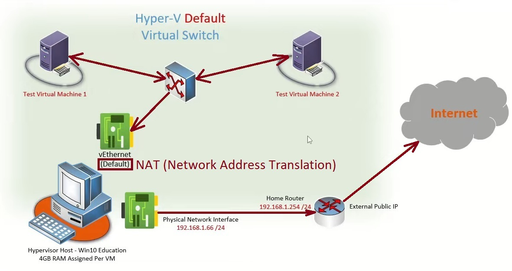


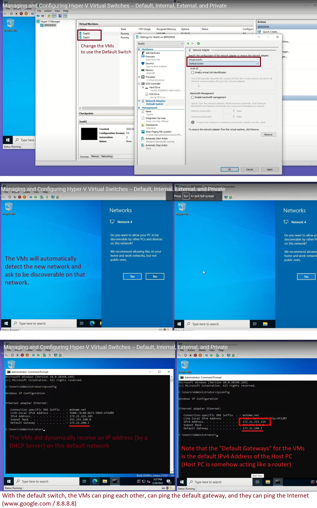

<br/>

## External Switch

**External Switch (Bridged Network)**:

- The external switch in Hyper-V bridges the virtual machines' network adapters directly to the **physical network adapter of the host machine**.

- **Virtual machines connected to the external switch appear as if they are directly connected to the same network as the host machine.**

- Communication between the virtual machines and devices on the external network is straightforward, as they are all part of the same network segment. Devices on the local network can communicate directly with the virtual machines, and vice versa, without any additional configuration.

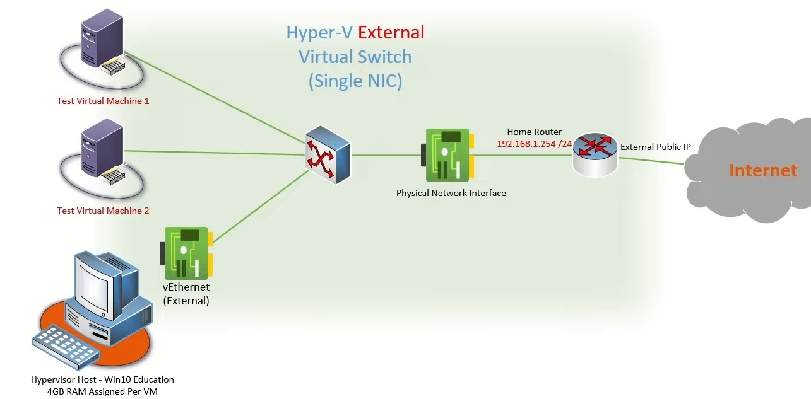

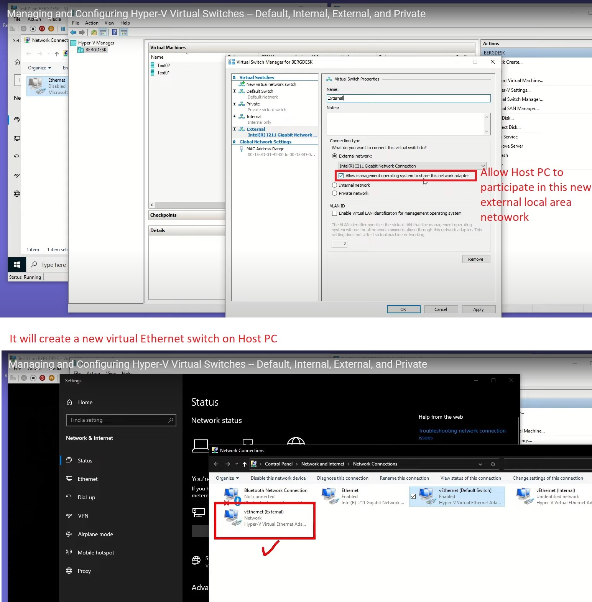

<br/>

# Setting VMs environment using Windows Hyper-V Manager to run the app

(Saturday, April 27, 2024, 12:40)

## Running the app on CentOS8

👉 Using the steps from [Running the application without Docker on CentOS 8 VM](./README_CentOS8.md), we should have a running ServerPing Status Tracker Application running on VM machine on ports:

```bash
ip addr show eth0
```

Backend using maven:

```bash
ssh root@172.28.131.41

# Start MySQL Service
sudo systemctl start mysqld.service

# Build and Run SpringBoot BackEnd
export CLIENT_ALLOWED_CORS_ORIGINS="http://172.28.131.41"

mvn spring-boot:run
```

Frontend using nginx:

```bash
ssh root@172.28.131.41

# Build Angular FrontEnd
vi /opt/serverpingstatustracker/serverpingstatustracker-app/src/environments/environment.prod.ts

export const environment = {
  production: true,
  apiBaseUrl: 'http://172.28.131.41:8080',
};

cd /opt/serverpingstatustracker/serverpingstatustracker-app
npm run build --prod

ls /opt/serverpingstatustracker/serverpingstatustracker-app/dist/out;


# Run Angular FrontEnd using Nginx
cd /etc/nginx/conf.d
vi angular-app.conf

server {
  include /etc/nginx/mime.types;
  listen 8081;
  location / {
    add_header 'Access-Control-Allow-Origin' '*';
    add_header 'Access-Control-Allow-Methods' 'GET, POST, OPTIONS, PUT, DELETE';
    add_header 'Access-Control-Allow-Headers' 'X-Requested-With,Accept,Content-Type, Origin';
    root /opt/serverpingstatustracker/serverpingstatustracker-app/dist/out;
    index index.html index.htm;
    try_files $uri $uri/ /index.html =404;
  }
}

sudo nginx -t
# systemctl stop nginx.service
systemctl status nginx.service
systemctl start nginx.service
systemctl reload nginx.service
```

- http://172.28.131.41:8081 (FrontEnd Angular App)
- http://172.28.131.41:8080/api/servers/ (BackEnd Spring Boot App)

<br/>

## Running the app on RHEL8 with Docker

👉 Using the steps from [Running the application with docker compose on RedHat 8.9 VM](./README_Docker_RedHat.md), we should have a running ServerPing Status Tracker Application running on VM machine on ports:

```bash
ip addr show eth0
```

```bash
ssh root@172.28.133.6

cd /opt/serverpingstatustracker
vi docker-compose.yml

# Backend Service
CLIENT_ALLOWED_CORS_ORIGINS: http://172.28.133.6:8081

# Frontend Service
API_BASE_URL: http://172.28.133.6:8080

cat docker-compose.yml | grep "172.28.133.6"
      # CLIENT_ALLOWED_CORS_ORIGINS: http://172.28.133.6:8081
      #   API_BASE_URL: http://172.28.133.6:8080

# docker image ls
# docker image prune -a
docker compose up
```

- http://172.28.133.6:8081 (FrontEnd Angular App)
- http://172.28.133.6:8080/api/servers/ (BackEnd Spring Boot App)

<br/>
<br/>

Both of the above applications should be accessible from our Local Windows PC (Host for the above RedHat and CentOS VMs) using Windows Hyper-V's **Default Switch**:

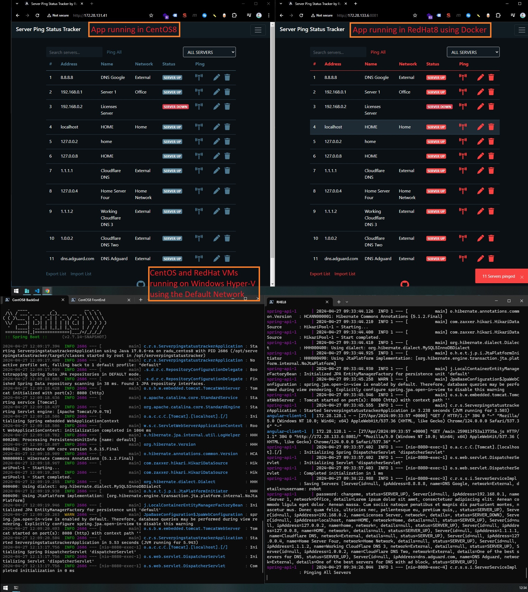

<br/>

Here's a minimal schema of this current setup for the above CentOS and RedHat VMs on HyperV Default Network on Windows Laptop:

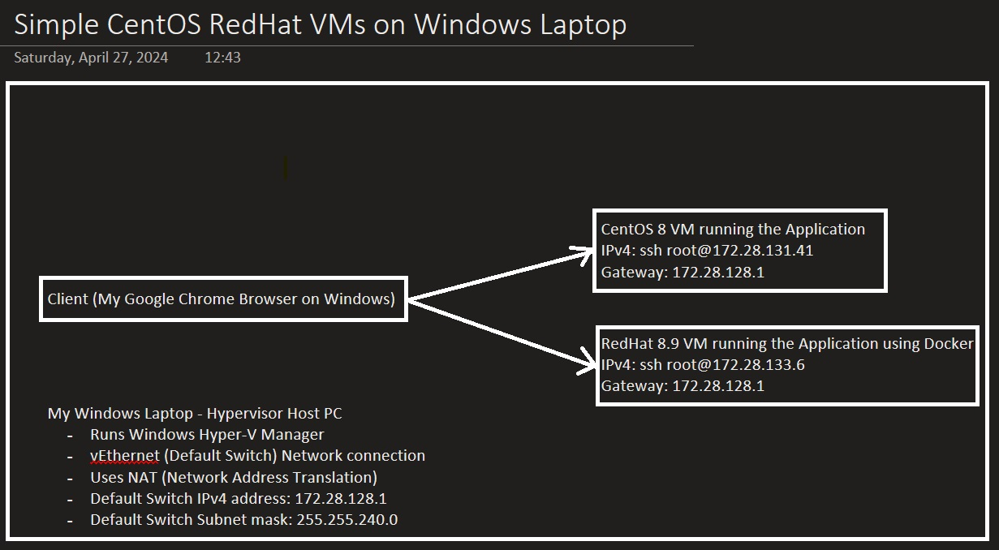

https://www.cyberciti.biz/faq/how-to-find-gateway-ip-address/

<br/>

# Load Balancer using Default Switch

## Installing another RHEL9.2 VM

> ~~From https://ubuntu.com/download/server#manual-install we can download an **Ubuntu Server** `ubuntu-24.04-live-server-amd64.iso` (2.7 GB)~~ We will actually use a Red Hat Enterprise 9.2 Server instead.
>
> Note: RHEL 9.4 is still in beta as of April/May 2024 and the download/fetching of resources for "Software Installation" during RHEL install did not work (installation process of `rhel-9.4-beta-x86_64-boot.iso` did not work).

From https://developers.redhat.com/products/rhel/download we can download RHEL 9.2 Beta x86_64 Boot iso `rhel-9.2-x86_64-boot.iso` (885.760 MB)

On Windows Hyper-V Manager click on "New" > "Virtual Machine" > Name: "RHEL9.2"

- "Generation 1" (Generation 2 might remain stuck on HyperV Boot Screen, as it's more for Windows Operating Systems)
- Startup Memory 1024 MB with Dynamic Memory Type Checked
- Network Connection: "Default Switch"
- Installation Options: "Install Operating System from a bootable image file" and select the rhel iso
- Note: If you want to delete and reinstall the VM, you need to manually delete the Virtual Hard Disk on `C:\ProgramData\Microsoft\Windows\Virtual Hard Disks\RHEL9.2.vhdx (VHDX, dynamically expanding)` and create a new one (create new drive automaically during the setup)

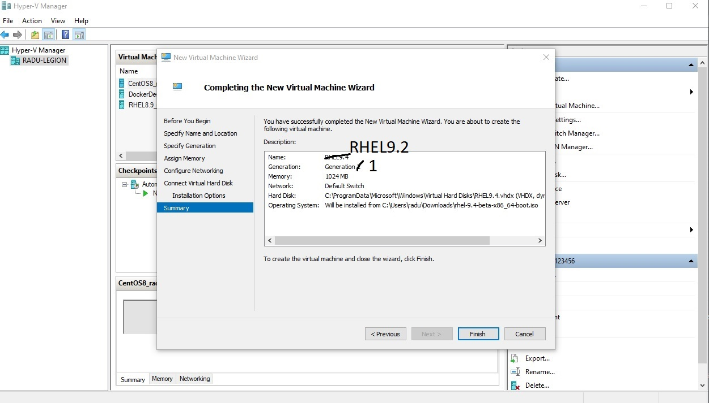

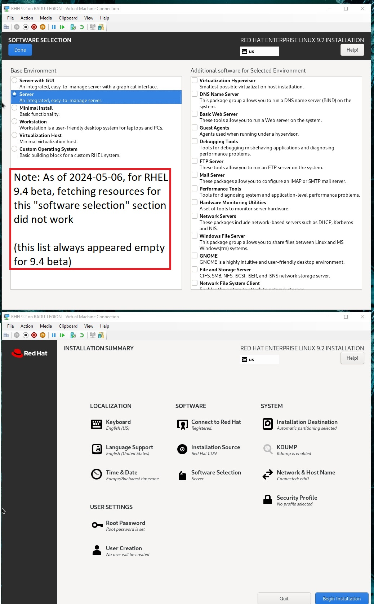

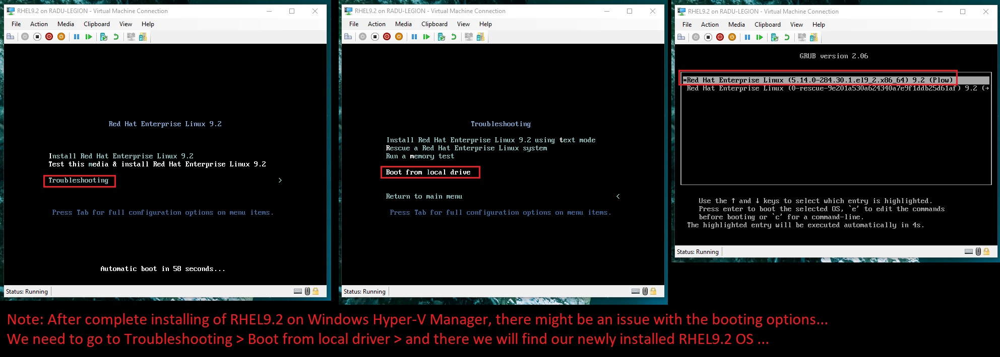

```bash
cat /etc/redhat-release
# Red Hat Enterprise Linux release 9.2 (Plow)
```

<br/>

## Installing Nginx on RHEL8 or RHEL9

From https://access.redhat.com/documentation/en-us/red_hat_enterprise_linux/8/html/deploying_different_types_of_servers/setting-up-and-configuring-nginx_deploying-different-types-of-servers

```bash
sudo yum install nginx

# Last metadata expiration check: 0:00:51 ago on Mon 06 May 2024 12:33:32 PM EEST.
# Dependencies resolved.
# ======================================================================================================
#  Package                Arch       Version                 Repository                            Size
# ======================================================================================================
# Installing:
#  nginx                  x86_64     1:1.20.1-14.el9_2.1     rhel-9-for-x86_64-appstream-rpms      40 k
# Installing dependencies:
#  nginx-core             x86_64     1:1.20.1-14.el9_2.1     rhel-9-for-x86_64-appstream-rpms     574 k
#  nginx-filesystem       noarch     1:1.20.1-14.el9_2.1     rhel-9-for-x86_64-appstream-rpms      11 k
#  redhat-logos-httpd     noarch     90.4-2.el9              rhel-9-for-x86_64-appstream-rpms      18 k

# Transaction Summary
# ======================================================================================================
# Install  4 Packages

# Total download size: 643 k
# Installed size: 1.8 M

yum list installed nginx
# Installed Packages
# nginx.x86_64        1:1.20.1-14.el9_2.1    @rhel-9-for-x86_64-appstream-rpms
```

```bash
nginx -v
# nginx version: nginx/1.20.1
```

Open the ports on which NGINX should provide its service in the firewall. For example, to open the default ports for HTTP (port 80) and HTTPS (port 443) in firewalld, enter:

```bash
firewall-cmd --permanent --add-port={80/tcp,443/tcp}
firewall-cmd --reload
```

(Optional) Enable the nginx service to start automatically when the system boots:

```bash
systemctl enable nginx
```

Check nginnx service status:

```bash
systemctl status nginx
# ○ nginx.service - The nginx HTTP and reverse proxy server
#      Loaded: loaded (/usr/lib/systemd/system/nginx.service; enabled; preset: disabled)
#      Active: inactive (dead)

systemctl start nginx
```

<br/>

## Configuring Nginx Load Balancer on RHEL9.2 VM

(Thursday May 02, 2024, 16:46 - In train)

Let's first create a custom load balancer nginx configuration file:

```bash
cd /etc/nginx/conf.d/
vi lb.conf
```

And add the following:

```bash
upstream lb_backend_upstream {
    # ip_hash;
    server 172.28.83.40:8080;
    server 172.28.91.22:8080;
}

upstream lb_frontend_upstream {
    # ip_hash;
    server 172.28.83.40:8081;
    server 172.28.91.22:8081;
}

server {
    listen 8880;
    # listen 8880 ssl;
    # ssl_certificate /etc/ssl/certs/nginx-selfsigned.crt;
    # ssl_certificate_key /etc/ssl/private/nginx-selfsigned.key;
    include /etc/nginx/mime.types;

    access_log /var/log/nginx/lb_backend_access.log;
    error_log /var/log/nginx/lb_backend_error.log;

    location / {
        proxy_pass http://lb_backend_upstream;
        # proxy_ssl_verify off;
        proxy_set_header Host $host;
        proxy_set_header X-Real-IP $remote_addr;
        proxy_set_header X-Forwarded-For $proxy_add_x_forwarded_for;
        proxy_set_header X-Forwarded-Proto $scheme;
    }
}

server {
    listen 8881;
    # listen 8881 ssl;
    # ssl_certificate /etc/ssl/certs/nginx-selfsigned.crt;
    # ssl_certificate_key /etc/ssl/private/nginx-selfsigned.key;
    include /etc/nginx/mime.types;

    access_log /var/log/nginx/lb_frontend_access.log;
    error_log /var/log/nginx/lb_frontend_error.log;

    location / {
        proxy_pass http://lb_frontend_upstream;
        # proxy_ssl_verify off;
        proxy_set_header Host $host;
        proxy_set_header X-Real-IP $remote_addr;
        proxy_set_header X-Forwarded-For $proxy_add_x_forwarded_for;
        proxy_set_header X-Forwarded-Proto $scheme;
    }
}
```

Let's remember the port used for Ping Status Tracker Apps on the two VMs:

- CentOS 8 VM running the app using the dependecies installed locally:

  - http://172.28.83.40:8081 (FrontEnd Angular App)
  - http://172.28.83.40:8080/api/servers/ (BackEnd Spring Boot App)

- RedHat 8 VM running the app via docker compose
  - http://172.28.91.22:8081/ (FrontEnd Angular App)
  - http://172.28.91.22:8080/api/servers/ (BackEnd Spring Boot App)

<br/>

Verify Nginx Configuration to checks the syntax of all Nginx configuration files and reports any errors:

```bash
sudo nginx -t
# nginx: the configuration file /etc/nginx/nginx.conf syntax is ok
# nginx: configuration file /etc/nginx/nginx.conf test is successful
```

<br/>

🟡 However, if we try to start the nginx service, on RedHat, we will receive the following errors:

```bash
sudo systemctl start nginx
# or
sudo systemctl reload nginx
# Job for nginx.service failed because the control process exited with error code.
# See "systemctl status nginx.service" and "journalctl -xe" for details.

sudo systemctl status nginx
# ● nginx.service - The nginx HTTP and reverse proxy server
#    Loaded: loaded (/usr/lib/systemd/system/nginx.service; enabled; vendor preset: disabled)
#    Active: failed (Result: exit-code) since Thu 2024-05-02 09:30:45 EDT; 39s ago
#   Process: 34462 ExecStart=/usr/sbin/nginx (code=exited, status=1/FAILURE)
#   Process: 35387 ExecStartPre=/usr/sbin/nginx -t (code=exited, status=1/FAILURE)
#   Process: 35385 ExecStartPre=/usr/bin/rm -f /run/nginx.pid (code=exited, status=0/SUCCESS)

# May 02 09:30:45 radu_rhel8 systemd[1]: Starting The nginx HTTP and reverse proxy server...
# May 02 09:30:45 radu_rhel8 nginx[35387]: nginx: the configuration file /etc/nginx/nginx.conf syntax is ok
# May 02 09:30:45 radu_rhel8 nginx[35387]: nginx: [emerg] bind() to 0.0.0.0:8880 failed (13: Permission denied)
# May 02 09:30:45 radu_rhel8 nginx[35387]: nginx: configuration file /etc/nginx/nginx.conf test failed
# May 02 09:30:45 radu_rhel8 systemd[1]: nginx.service: Control process exited, code=exited status=1
# May 02 09:30:45 radu_rhel8 systemd[1]: nginx.service: Failed with result 'exit-code'.
# May 02 09:30:45 radu_rhel8 systemd[1]: Failed to start The nginx HTTP and reverse proxy server
```

> https://askubuntu.com/questions/105200/what-is-the-difference-between-service-restart-and-service-reload
> restart = stop + start
> reload = remain running + re-read configuration files.

<br/>

To solve this, we need to run on RHEL the following to add a policy allowing Nginx to bind to the specific ports for load balancer:

```bash
sudo semanage port -a -t http_port_t -p tcp 8880
sudo semanage port -a -t http_port_t -p tcp 8881
```

<br/>

🟡 Optional: We can also run the followings from https://stackoverflow.com/questions/42303401/nginx-will-not-start-address-already-in-use if nginx port 80 already used by redhat test page

```bash
sudo netstat -tulpn
# Proto Recv-Q Send-Q Local Address           Foreign Address         State       PID/Program name
# tcp6       0      0 :::80                   :::*                    LISTEN      1233/httpd

sudo kill -2 1233

sudo systemctl reload nginx
```

<br/>

🟡 Now, if we try to access the (Frontend of) Ping Status Tracker App on the above load balancer on port 8080 (e.g. `http://172.28.91.22:8880/`) we might get the following issue on browser:

```
This site can’t be reached
172.28.91.22 took too long to respond.
ERR_CONNECTION_TIMED_OUT
```

For this we need to ensure that the ports for this load balancer 8880 and 8881 are open on the firewall and that the default network configuration (on RHEL LB Machine) allows incoming connections to these ports. We can use tools like firewall-cmd (for firewalld) or iptables (directly) to manage firewall rules, depending on what's being used in your environment:

```bash
sudo firewall-cmd --zone=public --add-port=8880/tcp --permanent
sudo firewall-cmd --zone=public --add-port=8881/tcp --permanent
# success

sudo firewall-cmd --reload
```

<br/>

🟡 (Optional) On RHEL9.2, when we try to access any of the load balancer ports (e.g. http://172.28.91.22:8881), we may get a "502 Bad Gateway" error in the browser. From https://serverfault.com/questions/819423/reverse-proxy-nginx-bad-gateway we can run:

```bash
# SELinux enabled, which may block Nginx from making outbound connections
getenforce
# Enforcing

setsebool -P httpd_can_network_connect true
```

<br/>

When trying to access the Load Balancer frontend port in chrome, we might also get the console error:

```
Failed to load module script: Expected a JavaScript module script but the server responded with a MIME type of "text/html". Strict MIME type checking is enforced for module scripts per HTML spec.
```

Resources:

- https://stackoverflow.com/questions/72070748/failed-to-load-module-script-expected-a-javascript-module-script-but-the-server
- https://stackoverflow.com/questions/29573489/nginx-failing-to-load-css-and-js-files-mime-type-error
- https://stackoverflow.com/questions/75594711/how-to-fix-server-responded-with-a-mime-type-of-text-plain

<br/>

🟡 Note: On both "CentOS" and "RHEL running Docker" machines, we will need to add to CORS the the Load Balancer Server IP Address

- On app within Cent OS

```bash
export CLIENT_ALLOWED_CORS_ORIGINS="http://172.28.83.40:8081,http://172.28.90.176:8881"
cd /opt/serverpingstatustracker/
mvn spring-boot:run
```

```bash
vi /opt/serverpingstatustracker/serverpingstatustracker-app/src/environments/environment.prod.ts
export const environment = {
  production: true,
  apiBaseUrl: 'http://172.28.90.176:8880',
};

cd /opt/serverpingstatustracker/serverpingstatustracker-app
npm run build --prod

systemctl restart nginx.service
systemctl reload nginx.service
```

- On app within Redhat running Docker

```bash
cd /opt/serverpingstatustracker
vi docker-compose.yml

CLIENT_ALLOWED_CORS_ORIGINS: http://172.28.133.6:8081,http://172.28.90.176:8881
API_BASE_URL: http://172.28.90.176:8880

docker compose down --remove-orphans
docker image rm serverpingstatustracker-angular-client
docker image rm serverpingstatustracker-spring-api
docker compose up
```

<br/>

## Load Balancer and VMs Schema on Default Switch

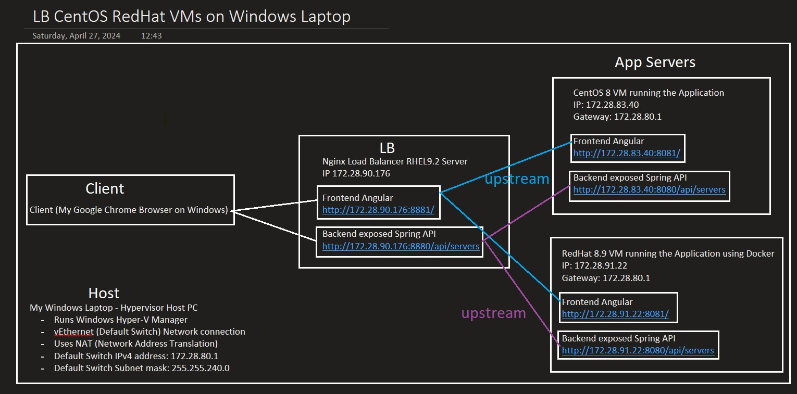

<br/>

# Load Balancer using External Switch

Using the **Default Switch** above will not allow us to access the above applications running on Hyper-V VMs from other devices in our main network (e.g. our in-home router network).

For this, we will need to configure our Hyper-V Manager to create and use and **External Switch** where both VMs will be connected to, as well as our local Windows PC "Host" and our other devices.

Note that once we will have an external network, our physical router in our house will assign each VM with a private IP address (The router is a DHCP server).

<br/>

## Installing Nginx on Raspberry Pi 4

Before creating an external switch on Windows Hyper-V Manager, let's configure an external PC / device to act as a load balancer in our main local network.

We will use a Raspberry Pi 4 (https://linuxconfig.org/checking-your-raspberry-pis-os-version):

```bash
hostnamectl
  #  Static hostname: raspberrypi
  #        Icon name: computer
  #       Machine ID: 3e23e34d17484a28b9473f69f7d9d21c
  #          Boot ID: fb6d51bf2eff4dcabe75f0007e82c8fe
  # Operating System: Raspbian GNU/Linux 11 (bullseye)
  #           Kernel: Linux 6.1.21-v8+
  #     Architecture: arm64

cat /etc/os-release
# PRETTY_NAME="Raspbian GNU/Linux 11 (bullseye)"
# NAME="Raspbian GNU/Linux"
# VERSION_ID="11"
# VERSION="11 (bullseye)"
# VERSION_CODENAME=bullseye
# ID=raspbian
# ID_LIKE=debian
# HOME_URL="http://www.raspbian.org/"
# SUPPORT_URL="http://www.raspbian.org/RaspbianForums"
# BUG_REPORT_URL="http://www.raspbian.org/RaspbianBugs"

lsb_release -a
# No LSB modules are available.
# Distributor ID: Raspbian
# Description:    Raspbian GNU/Linux 11 (bullseye)
# Release:        11
# Codename:       bullseye

uname -a
# Linux raspberrypi 6.1.21-v8+ #1642 SMP PREEMPT Mon Apr  3 17:24:16 BST 2023 aarch64 GNU/Linux

date
# Wed 01 May 2024 11:12:23 AM EEST
```

<br/>
<hr/>

From https://www.onlogic.com/company/io-hub/how-to-ssh-into-raspberry-pi/

- We can enable SSH on Raspberry Pi with Raspbian OS by running on Raspberry:

```bash
sudo raspi-config

# Use the arrow keys to navigate to Interfacing Options. Press the Enter key.
# Go to SSH, and press enter.
# When prompted, select <Yes>.
# Select Enter to confirm, then click Finish to exit raspi-config.
# Close the terminal window.
```

- To find the raspberry pi's IP address, run `ip addr show wlan0` (or `ip addr show eth0` if ethernet cable is connected to the raspberry pi) - Or just run `hostname -I`

<br/>
<hr/>

From https://pimylifeup.com/raspberry-pi-nginx/

- (Optional) Install latest updates to all packages:

```bash
sudo apt update
sudo apt upgrade

# or using -y flag to skip confirmation dialogs
sudo apt update -y && sudo apt upgrade -y
```

- To install Nginx, we can run

```bash
sudo apt install nginx

# The following packages were automatically installed and are no longer required:
#   libfuse2 python-is-python2 raspinfo
# Use 'sudo apt autoremove' to remove them.
# The following additional packages will be installed:
#   geoip-database libgeoip1 libnginx-mod-http-geoip libnginx-mod-http-image-filter libnginx-mod-http-xslt-filter
#   libnginx-mod-mail libnginx-mod-stream libnginx-mod-stream-geoip nginx-common nginx-core
# Suggested packages:
#   geoip-bin fcgiwrap nginx-doc
# The following NEW packages will be installed:
#   geoip-database libgeoip1 libnginx-mod-http-geoip libnginx-mod-http-image-filter libnginx-mod-http-xslt-filter
#   libnginx-mod-mail libnginx-mod-stream libnginx-mod-stream-geoip nginx nginx-common nginx-core
# 0 upgraded, 11 newly installed, 0 to remove and 10 not upgraded.
# Need to get 4,458 kB of archives.
# After this operation, 13.1 MB of additional disk space will be used
```

```bash
nginx -v
# nginx version: nginx/1.18.0
```

- Note: After installing the above, the Nginx should be already running:

```bash
sudo systemctl status nginx

● nginx.service - A high performance web server and a reverse proxy server
     Loaded: loaded (/lib/systemd/system/nginx.service; enabled; vendor preset: enabled)
     Active: active (running) since Wed 2024-05-01 11:13:49 EEST; 7min ago
       Docs: man:nginx(8)
    Process: 5285 ExecStartPre=/usr/sbin/nginx -t -q -g daemon on; master_process on; (code=exited, status=0/SUCCESS)
    Process: 5286 ExecStart=/usr/sbin/nginx -g daemon on; master_process on; (code=exited, status=0/SUCCESS)
   Main PID: 5371 (nginx)
      Tasks: 5 (limit: 3933)
        CPU: 94ms
     CGroup: /system.slice/nginx.service
             ├─5371 nginx: master process /usr/sbin/nginx -g daemon on; master_process on;
             ├─5374 nginx: worker process
             ├─5375 nginx: worker process
             ├─5376 nginx: worker process
             └─5377 nginx: worker process

May 01 11:13:49 raspberrypi systemd[1]: Starting A high performance web server and a reverse proxy server...
May 01 11:13:49 raspberrypi systemd[1]: Started A high performance web server and a reverse proxy server.
```

- If Nginx is not running, we can just start it via

```bash
sudo systemctl start nginx
```

- If we go (from another PC/laptop) on Raspbberry's Pi local IPv4 Address, we should see the Welcome Page of Nginx - e.g. `http://<RaspberryIpAddress>/`

<br/>
<hr/>

### Optional Creating and testing a simple Nginx Web Server on Raspberry Pi

First we can create `web.conf` file (`/etc/nginx/conf.d/web.conf`):

```bash
cd /etc/nginx/conf.d/
sudo vi web.conf
```

```nginx
# web.conf
server {
  listen 9001;
  index index.html;
  add_header Custom-Header "Application 1";

  location / {
    root /opt/services/NginxSampleApp1;
  }
}
```

```bash
cat web.conf
```

<br/>

We can now create a very simple web application. For this, we need to ensure the `/opt/services/NginxSampleApp1` directory exist and contain the HTML files.

```bash
# First we create the folder for the web app
sudo mkdir -p /opt/services/NginxSampleApp1

# -p stands for 'parents', to create parent directories if they don't exist
```

Let's create the `index.html` file:

```bash
cd /opt/services/NginxSampleApp1
sudo vi index.html
```

```html
<!-- /opt/services/NginxSampleApp1/index.html -->
<!DOCTYPE html>
<html lang="en">
  <head>
    <meta charset="UTF-8" />
    <meta name="viewport" content="width=device-width, initial-scale=1.0" />
    <title>Web Application 1</title>
    <style type="text/css">
      body {
        font-family: sans-serif;
        font-size: 16px;
        color: #000;
        /* useful for sticking the footer to bottom of page */
        min-height: 100%;
        display: flex;
        flex-direction: column;
        background-color: #b3e8ff;
        transition: background-color 200ms ease-in;
      }
    </style>
  </head>
  <body>
    <h1>Hello from Web Application 1</h1>
  </body>
</html>
```

<br/>

Now, to restart the Nginx web server, we need to run:

```bash
sudo service nginx reload
```

And go to `http://<Raspberry_IP_Address>:9001/`

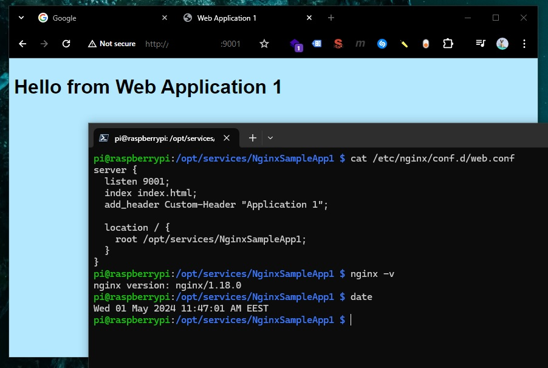

<br/>

<br/>

<br/>

## Creating an External Switch on Windows Hyper-V Manager

<br/>

## Testing connection between VMs, Host, and External Devices

<br/>

<br/>

<br/>

<br/>

<br/>

<br/>

<br/>

## Configuring Nginx Load Balancer on Raspbian OS (Debian)

<br/>

<br/>

<br/>

<br/>

## Load Balancer and VMs Schema on External Switch

<br/>

<br/>

<br/>

<br/>

<br/>

<br/>

<br/>

<br/>

<br/>

<br/>

<br/>

<br/>

<br/>
